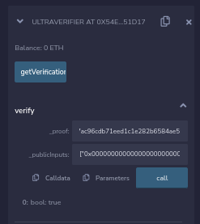

# MINI CTF
## There is no prize it's just to learn.
The files needed are in a the main directory of this miniCTF folder. 
I have created a mini CTF on the `Sepolia` network. 
[https://sepolia.etherscan.io/address/0x54ea97c4b15bb81744fdd82d7fd3466d4b151d17](https://sepolia.etherscan.io/address/0x54ea97c4b15bb81744fdd82d7fd3466d4b151d17) 
The aim of the CTF is to generate and submit a proof, that you know the `inputValue` of the NoirLang twitter handle [https://twitter.com/NoirLang](https://twitter.com/NoirLang), as a string (including "") and the `inputNum` of 1. 
## AIM 
To generate and submit a proof to the contract and get a response as `true`
## Helpful links:
[https://noir-lang.org/getting_started/breakdown](https://noir-lang.org/getting_started/breakdown) 
[https://github.com/noir-lang/noir-starter](https://github.com/noir-lang/noir-starter)

You can use REMIX to interact with `plonk_vk.sol` supplied in the `contract` directory of this miniCTF, the contract is on the `Sepolia` test net at the address **0x54ea97c4b15Bb81744fDD82d7FD3466D4b151D17**  
If the proof submitted is correct it will return ***true*** on the call to the function `verify`. 
  
## DISCLAIMER: Do not use any of this code in production it's just an example. always verify software.
