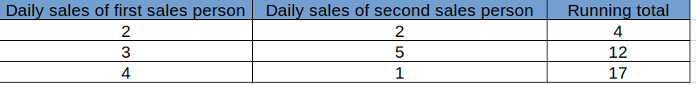
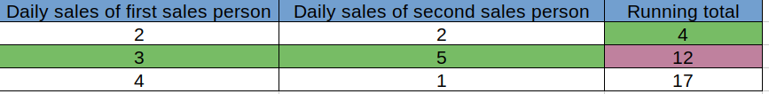
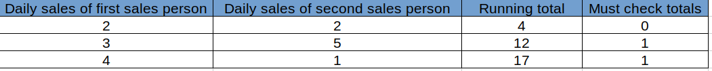
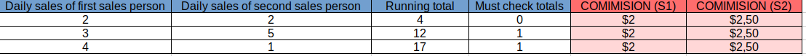
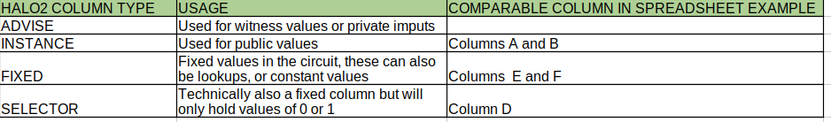

Halo2 101

Halo2 is an API implemented in Rust. It is used to create zero knowledge circuits used to prove and verify zero knowledge claims. In order to understand how to develop Halo2 circuits I believe it would be beneficial to first understand the table structure used by Halo2 and PLONKish arithmetic.

Let me start off by using an abstract example, I think this may make understanding the concept slightly easier.
Imagine a database table or an excel spreadsheet. Each column has a type of data it will hold, in a typical database the first column might be used for an auto-incrementing integer which will become the row index. The next column will hold a different type of data which the application will use internally for some function. Each row will be filled with values that correspond to the column data types. 

This is a long winded way to say each column has a function and each row is filled with data according to the column's data type.

The scenario we will use in our example is a list where sales are recorded.
There are two sales people and each day a tally of sales is recorded.
The spreadsheet consists of three columns, column A is sales done by the first sales person, column B is the number of sales per day by the second sales person and column C is used to capture a running total of sales.

In the example, the spreadsheet layout will be as set out in the image below.

Now we can build further on our spreadsheet application. Imagine we wanted to write a macro that would check each row and ensure the the value of ROW[CURRENT_ROW].COLUMN[A] + ROW[CURRENT_ROW].COLUMN[B] + ROW[PREVIOUS_ROW].COLUMN[C] = ROW[CURRENT_ROW].COLUMN[C] as in the image below.

Our first row does not have a previous row that the Column C can be checked against. To overcome this we decide to add an extra column that will only contain a 0 or a 1. If Column D has a value of 1 then it means we must run the check against this row to be sure our spreadsheet totals are correct. the new table layout will be a in the image below.

Our new spreadsheet is coming along well, but lets imagine we wanted to keep track of the commision earned by each Sales person. The commision scale for each sales person may be different, and we certainly would want to keep this information private. We could add columns to our spreadsheet that are hidden, and can only be shown if the user knows the password. The values could be seen a private inputs into the spreadsheet. We will use a background color of light red to show these columns in our pictures going forward, but for all intents and purposes they would not be visible to a normal user in the final spreadsheet. 

We will build on this example in the tutorial where we deal with writing custom gates. For now that abstract example will suffice to desribe the table structure used by HALO2.

There are different types of columns that are used for different types of data that will be used by the circuit. The table below lists these columns and the columns in our spreadsheet as reference.

This was a very high level look at the table structure used in HALO2, if you would like to get a more indepth view to build on this example I can recommend reading the HALO2 book at [https://zcash.github.io/halo2/concepts/arithmetization.html](https://zcash.github.io/halo2/concepts/arithmetization.html)

